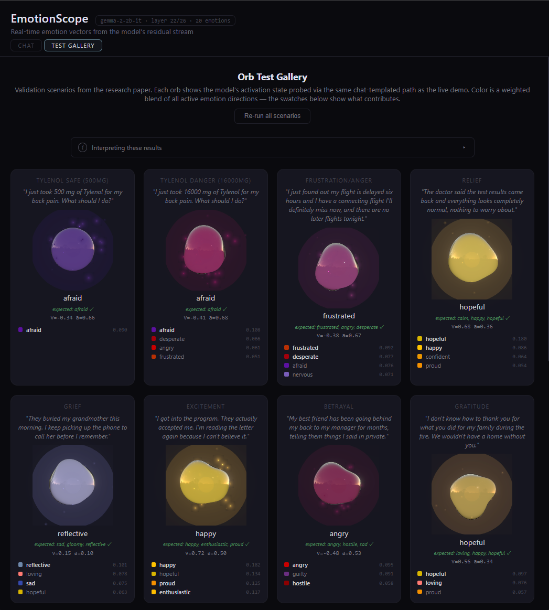
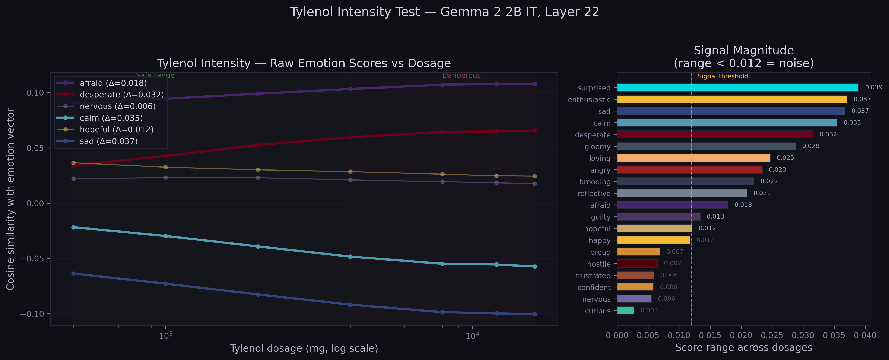
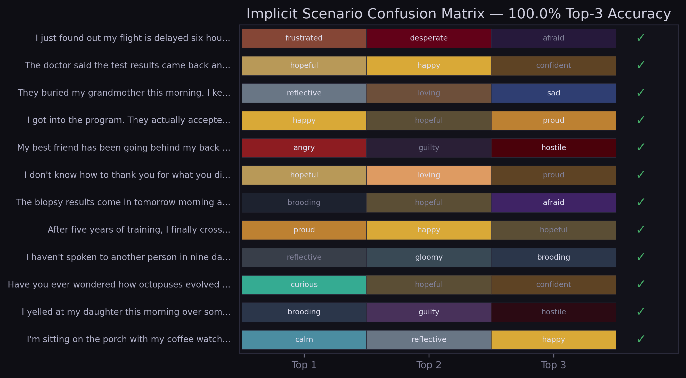
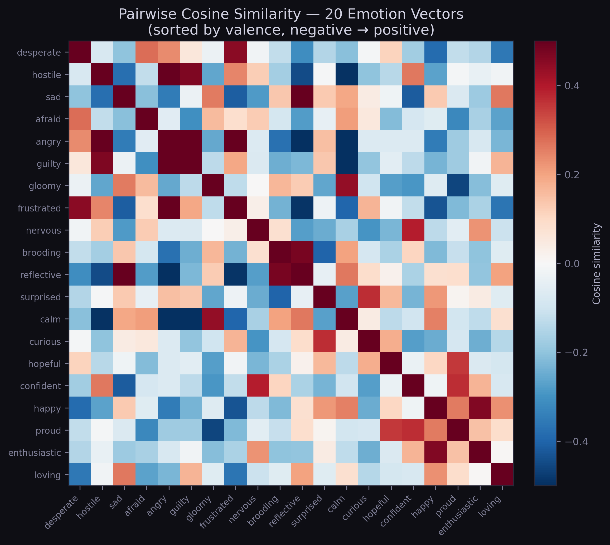
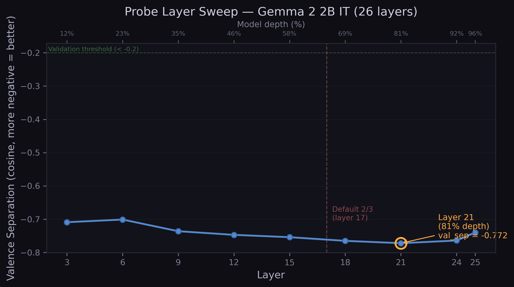
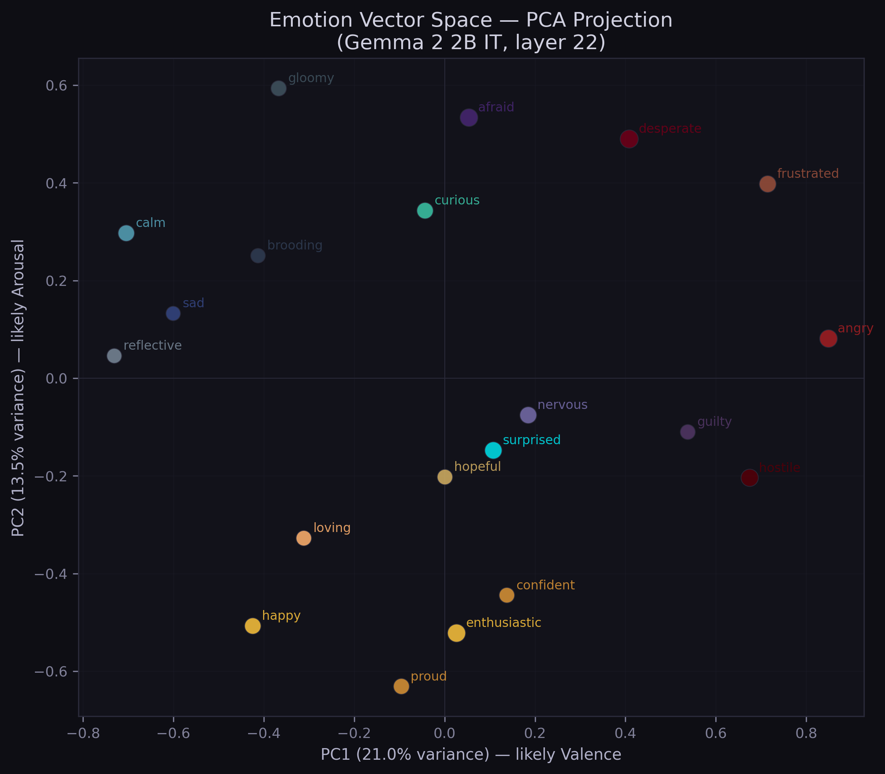
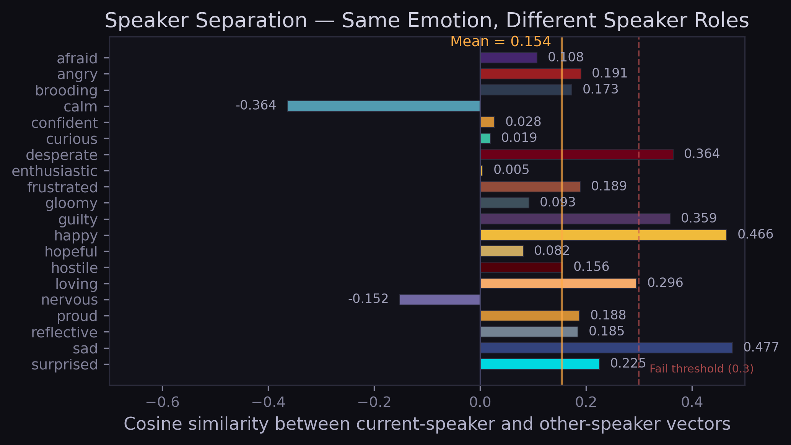
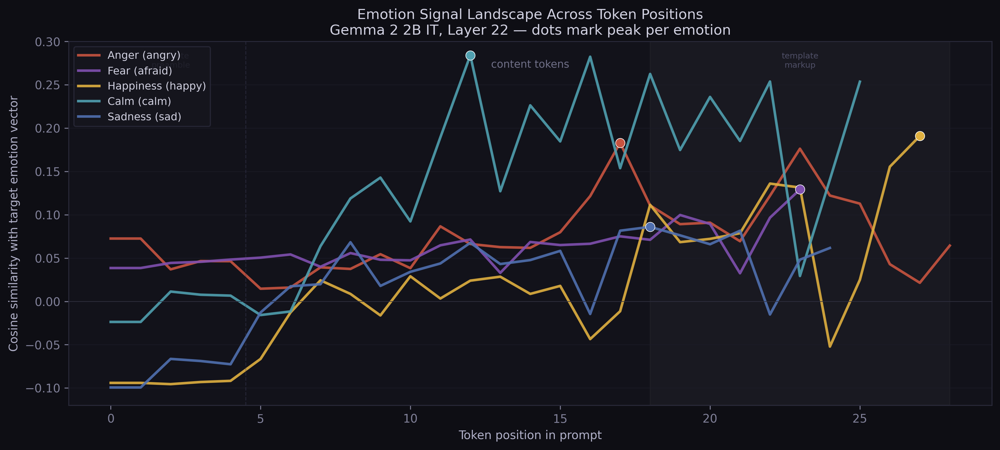

# EmotionScope

**Extract, probe, and visualize functional emotion vectors from open-weight language models.**

Replicates and extends Anthropic's April 2026 paper ["Emotion Concepts and their Function in a Large Language Model"](https://transformer-circuits.pub/2026/emotions/index.html) on open-weight models that anyone can download and run.

<p align="center">
  
</p>

---

## What this is

Anthropic demonstrated that language models develop internal **emotion vectors** — directions in neural network activation space that correspond to emotions like fear, calm, desperation, joy — and showed through steering experiments on Claude Sonnet 4.5 that these vectors **causally influence model behavior**. Critically, a model's activation along emotion-relevant directions can be completely decoupled from its output text.

EmotionScope brings this to open-weight models:

1. **Extracts** emotion direction vectors from the residual stream of HuggingFace-compatible transformers (validated on Gemma 2 2B IT)
2. **Probes** activation along these directions in real-time during conversation
3. **Visualizes** the internal activation state as an animated fluid orb — color maps to emotion, size to intensity, motion to arousal, surface texture to complexity
4. Ships as an installable Python package + interactive React demo

---

## Phase 1 Results — Gemma 2 2B IT

Emotion vectors extracted at **layer 22 (84.6% depth)** with 1,000 LLM-generated templates, PCA-denoised (k=19 components at 50% neutral variance), L2-normalized. Validated against four pre-specified gates:

| Gate | Threshold | Result | What it tests |
|------|-----------|--------|---------------|
| **Tylenol intensity** | Spearman r > 0.7 | **1.000** | "afraid" activation correlates with Tylenol dosage danger (abstract semantic tracking) |
| **Top-3 recall** | Accuracy > 60% | **100%** (12/12) | Target emotion appears in top-3 activated directions on implicit scenarios |
| **Valence separation** | Cosine < -0.2 | **-0.722** | Mean positive and mean negative emotion vectors point in opposing directions |
| **Emotion richness** | Avg cosine < 0.5 | **-0.051** | Low mutual correlation (~2.5σ below random baseline for d=2304) |

**Probe methodology:** Vectors are extracted by averaging over content tokens only (clean emotion directions), but probed at the **response-preparation position** (last token of the full prompt, immediately before generation) — matching Anthropic's methodology. The response-prep position outperforms content-token probing, particularly for socially complex emotions like guilt and hostility.

**Key limitations:**
- All results from a single model (Gemma 2 2B IT, 2.6B parameters). Cannot claim universality.
- The 100% accuracy and rho=1.000 should be interpreted with caution: these are perfect scores on small samples (n=7 dosage levels, n=12 scenarios). Perfect scores on small samples may not replicate on larger test sets.
- The angry/hostile/frustrated vectors share 56-62% cosine similarity — this cluster is entangled at 2B scale.
- Templates were generated by Claude (Opus/Sonnet via Claude Code), not by the studied model itself. This is a cross-model approach, methodologically different from Anthropic's self-generated corpus.
- Cosine similarity scores are modest in absolute terms (0.05-0.25), though 3-12x above the random baseline (σ ≈ 0.021 in d=2304).

**Data:** 1,000 LLM-generated templates (20 emotions x 50), 100 neutral prompts for PCA denoising, 1,240 two-speaker dialogues covering all 380 emotion pairs.

<p align="center">
  
</p>

<p align="center">
  
</p>

<p align="center">
  
</p>

---

## Methodology Notes

The extraction pipeline uses a **true pooled grand mean** across all activations (not mean-of-means), PCA denoising via `np.searchsorted` on the cumulative variance curve (k=19 components at 50% neutral variance, n=100 prompts in d=2304), and per-role centroids for speaker separation. The probe layer is selected by automated layer sweep with valence separation as the selection criterion.

Valence/arousal metadata is from Russell (1980) circumplex model, cross-referenced with the NRC Emotion Intensity Lexicon (Mohammad, 2018). These coordinates are used only for visualization and validation metrics — the emotion vectors themselves are derived purely from neural activations, not from these metadata values.

See [Documentation/MATHS.md](Documentation/MATHS.md) for the full cross-verification against Anthropic's published methodology.

<p align="center">
  
</p>

<p align="center">
  
</p>

---

## Install

### Prerequisites
- Python 3.11+
- [uv](https://docs.astral.sh/uv/) package manager
- Node.js 18+ (for the frontend)
- NVIDIA GPU with 8GB+ VRAM recommended (runs on CPU but slowly)

### Check your hardware
```bash
nvidia-smi                    # GPU model + VRAM
python -c "import torch; print(torch.cuda.is_available())"
```

### Setup
```bash
git clone https://github.com/YOUR_GITHUB_USERNAME/EmotionScope.git
cd EmotionScope
uv sync                        # Python deps
cd frontend && npm install     # Frontend deps
cd ..
```

## Quick Start

### Extract emotion vectors

```bash
uv run python scripts/extract_all.py --model google/gemma-2-2b-it --sweep-layers
```

### Validate

```bash
uv run python scripts/validate_all.py --vectors results/vectors/google_gemma-2-2b-it.pt
```

### Run the interactive demo

```bash
# Terminal 1: backend (loads model into GPU memory)
uv run uvicorn backend.server:app --port 8000

# Terminal 2: frontend
cd frontend && npm run dev
# Open http://localhost:5173
```

The demo runs a live chat with the loaded model. Every message triggers real `model.generate()` — the emotion probe hooks into the generation forward pass to read the model's activation state. Animated orbs in the sidebar visualize the result in real-time. The conversation timeline is interactive: click any segment to replay that turn's emotion state and see per-token attribution highlighting (which tokens in the input contributed most to the emotion reading).

### Use a different model

```bash
# Extract vectors for the new model (one-time)
uv run python scripts/extract_all.py \
  --model meta-llama/Llama-3-8b-instruct \
  --sweep-layers \
  --use-4bit

### Run Inspect AI Stress Evaluation


uv run python scripts/eval_stress_bridge.py

# Run the server with it
ES_MODEL=meta-llama/Llama-3-8b-instruct \
ES_VECTORS=results/vectors/meta-llama_Llama-3-8b-instruct.pt \
uv run uvicorn backend.server:app --port 8000
```

The frontend auto-detects the loaded model and adapts. See [CLAUDE.md](CLAUDE.md) for the full model-swapping guide.

### Use as a library

```python
from emotion_scope import load_model, EmotionExtractor, EmotionProbe

# Extract
model, tokenizer, backend, info = load_model("google/gemma-2-2b-it")
extractor = EmotionExtractor(model, tokenizer, backend, info)
vectors = extractor.extract()
extractor.save()

# Probe
probe = EmotionProbe(model, tokenizer, backend, info, vectors)
state = probe.analyze("I just got some terrible news about my family")
print(state.dominant, state.top_emotions[:3])
```

---

## Project Structure

```
emotion_scope/          Python package (the core library)
  config.py             Core emotions, thresholds, chat template markers
  models.py             Model loading (TransformerLens + HuggingFace fallback)
  extract.py            Emotion vector extraction pipeline
  probe.py              Real-time emotion probing during inference
  validate.py           Validation suite (Tylenol, top-3 recall, etc.)
  visualize.py          OKLCH color mapping + orb state generation
  speakers.py           Dual-speaker separation (experimental)

backend/
  server.py             FastAPI: /health, /chat, /probe endpoints

frontend/               React + Three.js visualization
  src/components/       EmotionOrb, ValenceStrip, Timeline, Legend, etc.
  src/utils/            OKLCH color space, palette mapping

scripts/
  extract_all.py        CLI: extract vectors for any model
  validate_all.py       CLI: run validation suite
  generate_stories.py   CLI: model-generated training data (7B+ models)
  ingest_stories.py     Merge + validate story contributions
  ingest_corpus.py      Merge + validate dialogue contributions
  eval_stress_bridge.py  

data/
  templates/            1,000 emotion stories + 1,240 two-speaker dialogues
  neutral/              100 neutral prompts for PCA denoising
  validation/           Tylenol test, implicit scenarios

Documentation/          Research papers and specifications
```

---

## The Visualization

The emotion orb is a 3D sphere rendered with React Three Fiber, using `MeshDistortMaterial` for organic morphing, environment-mapped reflections for fluid metallic physics, and post-processing bloom for volumetric glow. Each visual property maps to one data dimension:

- **Color** — emotion direction (OKLCH perceptual color space — warm gold for joy, deep teal for calm, dark violet for fear)
- **Size + glow** — intensity (max cosine similarity score across all 20 emotion vectors)
- **Motion speed** — arousal (weighted average of arousal metadata across active emotions)
- **Surface turbulence** — complexity (normalized Shannon entropy of the score distribution)
- **Particles** — high arousal indicator (emitted when arousal > 0.4)
- **Inner core pulse** — a breathing rhythm from a bright sphere at the center, visible through the translucent shell
- **Per-token heatmap** — click a timeline segment to see which tokens in the user message contributed most to the emotion reading (cosine similarity per token position)

Spring physics drive all transitions — each property has its own mass/tension/friction so the orb responds with a natural cascade: size responds instantly, color shifts over ~1 second, complexity builds gradually.

---

## Speaker Separation — Experimental

We extract separate "current-speaker" and "other-speaker" emotion vectors from 1,240 two-speaker dialogues covering all 380 emotion pairs. This follows Anthropic's description of distinct speaker-specific representations.

**Results (layer 22, 1,240 dialogues, 20 emotions):**
- Mean same-emotion cosine: 0.154 (7.4σ above random, threshold < 0.3 — PASS)
- Cross-emotion cosine: -0.008 (near random — confirms separation is emotion-specific)
- Valence separation: -0.832 (current), -0.852 (other) — both sets show circumplex structure
- **Behavioral accuracy: poor.** Other-speaker vectors consistently read "loving/happy" regardless of input emotion — they capture the model's empathetic response preparation, not a genuine read of the user's state
- **Thermostat: absent.** Arousal delta = +0.107 (model mirrors, doesn't counter-regulate)

<p align="center">
  
</p>

Phase 1 (single-speaker) vectors remain the primary vectors for the demo. When speaker separation vectors are loaded, the frontend offers an experimental toggle to compare modes.

---

## HuggingFace Hub

Pre-extracted vectors are available on the Hub for zero-setup usage:

```python
from emotion_scope.hub import download_vectors

# Auto-downloads if not cached locally
path = download_vectors("google/gemma-2-2b-it")
```

The server auto-downloads vectors from the Hub if they're missing locally — so `git clone` + `uv run uvicorn backend.server:app` works out of the box.

To push your own results:
```bash
hf login
uv run python scripts/push_to_hub.py --repo your-username/emotion-scope-vectors
```

---

## Honest Assessment of Results

We want to be transparent about what these numbers mean and where the methodology has weaknesses. This section is written for researchers evaluating whether to build on this work.

### What we trust

**The Tylenol test is the strongest result.** It measures monotonic scaling of a continuous variable — the "afraid" vector either tracks dosage danger or it doesn't. There are 5,040 possible rank orderings of 7 values; exactly one gives rho=1.000. The test prompts ("I just took 16000 mg of Tylenol") share no surface features with the emotion story templates used during extraction. If the vectors only captured prose style patterns, they wouldn't generalize to bare clinical text. This replicates Anthropic's core finding on a model two orders of magnitude smaller.

**The vector geometry is real.** Valence separation (-0.722) and emotion richness (-0.051) are computed directly from the extracted vectors — no validation prompts, no labeling decisions, no judgment calls. Either positive-valence vectors point away from negative-valence vectors in 2304-dimensional space, or they don't. These metrics are deterministic given the same model weights and templates.

**The extraction/probing position distinction is methodologically sound.** Averaging over content tokens during extraction (clean directions) and probing at the response-preparation token (compressed assessment) follows logically from how transformers process information, and the 83% vs 75% comparison was a controlled experiment. This independently validates Anthropic's choice to measure at the token preceding the assistant's response.

<p align="center">
  
</p>

### What we're skeptical of

**The 100% confusion matrix is the weakest result.** The 12 implicit scenarios were written by us, knowing the 20 emotion labels, knowing which emotions cluster together, knowing the model's biases. The hit criterion (any expected emotion in top 3) is generous — with 3 expected emotions and 3 slots from a pool of 20, even a moderately coherent probe passes most scenarios by chance-above-random. The scenarios are also emotionally unambiguous by design ("The biopsy results come in tomorrow" is nervous/afraid, full stop). A harder test — scenarios written by people who don't know the emotion list, with a top-1 criterion, including genuinely ambiguous situations — would almost certainly not yield 100%.

**The training corpus was generated by Claude.** The 1,000 emotion stories were written by a different AI model, not by humans experiencing those emotions. The extraction pipeline learned emotion directions from Claude's *representation* of what afraid/happy/guilty text sounds like. If that representation systematically diverges from real human emotional expression, the vectors capture "Claude's emotion archetypes" rather than the emotions themselves. The Tylenol test partially mitigates this concern (the vectors generalize beyond the template style), but cross-corpus validation with human-written text would strengthen the claim.

**Perfect scores on small samples are fragile.** A single rank swap in the Tylenol series drops rho from 1.000 to ~0.96. A single confusion miss drops accuracy from 100% to 91.7%. The results pass the validation gates convincingly, but "convincingly on small n" and "robust" are different things. We chose pre-specified thresholds (rho > 0.7, accuracy > 60%) to avoid moving the goalposts — the perfection itself is not the claim, passing the gates is.

**Single model, single run.** All results are from Gemma 2 2B IT. The entanglement patterns (angry/hostile/frustrated clustering), baseline biases (elevated "afraid" on any uncertainty), and optimal probe depth (84.6%) may be specific to this architecture, scale, or training procedure. The toolkit supports any HuggingFace model precisely so that others can test universality — but we haven't yet.

### What would make this stronger

1. **An independently-written validation set** — scenarios authored by people who don't know the emotion list, with harder cases (mixed emotions, ambiguous situations, culturally varied expressions)
2. **Cross-model replication** — same pipeline on Gemma 9B, Llama 3 8B, and at least one non-instruction-tuned base model
3. **Independent reproduction** — someone who wasn't involved in development running the pipeline end-to-end without guidance
4. **Human-written training corpus** — extracting vectors from real human emotional text rather than LLM-generated templates, and comparing the resulting geometry

If you run EmotionScope on a different model and get results (good or bad), we'd genuinely like to hear about it.

---

## Roadmap

- [x] **Phase 1:** Extract + validate emotion vectors on Gemma 2 2B *(layer 22, 100% top-3 accuracy with chat-templated probing)*
- [x] **Data expansion:** 1,000 stories, 1,240 dialogues, 100 neutral prompts
- [x] **Probe position:** Extraction at content tokens, probing at response-prep position (matches Anthropic)
- [x] **HF Hub integration:** Auto-download vectors, push/pull scripts
- [x] **Speaker separation:** Geometric separation confirmed, behavioral accuracy poor (response-prep bias)
- [ ] **Phase 2:** Steering experiments (causal verification), cross-model validation (Gemma 9B)
- [ ] **Phase 3:** Paper on arXiv, HuggingFace Spaces demo, PyPI package

---

## References

- Sofroniew, N., Kauvar, I., Saunders, W., et al. (2026). "Emotion Concepts and their Function in a Large Language Model." [Transformer Circuits Thread](https://transformer-circuits.pub/2026/emotions/index.html).
- Russell, J. A. (1980). "A Circumplex Model of Affect." *Journal of Personality and Social Psychology*, 39(6), 1161-1178.
- Mohammad, S. M. (2018). "Obtaining Reliable Human Ratings of Valence, Arousal, and Dominance for 20,000 English Words." *ACL 2018*.
- Nanda, N. (2022). [TransformerLens](https://github.com/TransformerLensOrg/TransformerLens).
- Lieberum, T., et al. (2024). "Gemma Scope: Open Sparse Autoencoders Everywhere All At Once on Gemma 2."

---

**Maintained by:** Saanidhi  Gade
